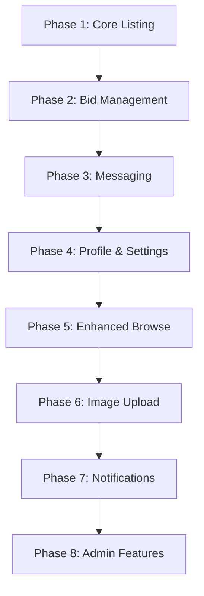

# Sarkin Mota Backend - Phased Implementation Plan

## Current Backend Status

### ✅ Already Implemented

| Feature                                         | File                   | Status   |
| ----------------------------------------------- | ---------------------- | -------- |
| User Authentication                             | [`app.py`](app.py:112) | Complete |
| Database Schema (users, cars, bids, saved_cars) | [`app.py`](app.py:27)  | Complete |
| Dashboard                                       | [`app.py`](app.py:176) | Complete |
| Browse Cars                                     | [`app.py`](app.py:294) | Complete |
| Place Bid                                       | [`app.py`](app.py:208) | Complete |
| Save/Unsave Car                                 | [`app.py`](app.py:242) | Complete |
| Cancel Bid                                      | [`app.py`](app.py:278) | Complete |

### ❌ Not Yet Implemented

| Feature                        | Templates                                                                        | Priority |
| ------------------------------ | -------------------------------------------------------------------------------- | -------- |
| Car Listing Creation           | [`templates/dashboard/ListCars.html`](templates/dashboard/ListCars.html)         | High     |
| Car Detail View                | [`templates/dashboard/Listing-Page.html`](templates/dashboard/Listing-Page.html) | High     |
| Seller Dashboard (My Listings) | Template needed                                                                  | High     |
| Bid Management (Accept/Reject) | Template needed                                                                  | High     |
| Messaging System               | [`templates/dashboard/Messages.html`](templates/dashboard/Messages.html)         | Medium   |
| Profile Management             | [`templates/dashboard/Profile.html`](templates/dashboard/Profile.html)           | Medium   |
| Account Settings               | [`templates/dashboard/Settings.html`](templates/dashboard/Settings.html)         | Medium   |
| Search & Filter                | [`templates/dashboard/BrowseCars.html`](templates/dashboard/BrowseCars.html)     | Low      |
| Image Upload                   | —                                                                                | Medium   |

---

## Phase 1: Core Listing Functionality

### Objective

Enable users to list cars for sale and view car details.

### Tasks

#### 1.1 Create Car Listing Route

```python
@app.route("/cars/create", methods=["GET", "POST"])
@login_required
def create_listing():
    """Create a new car listing."""
    # GET: Render form
    # POST: Insert car into database
```

**Required Fields:**

- make, model, year, price, mileage, condition, description, image_url, status

#### 1.2 View My Listings (Seller Dashboard)

```python
@app.route("/my-listings")
@login_required
def my_listings():
    """Show listings created by current user."""
```

#### 1.3 Car Detail View

```python
@app.route("/cars/<int:car_id>")
def car_detail(car_id):
    """Show full car details with bid history."""
```

#### 1.4 Edit Car Listing

```python
@app.route("/cars/<int:car_id>/edit", methods=["GET", "POST"])
@login_required
def edit_listing(car_id):
    """Edit existing car listing."""
```

#### 1.5 Delete/Deactivate Listing

```python
@app.route("/cars/<int:car_id>/delete", methods=["POST"])
@login_required
def delete_listing(car_id):
    """Soft delete or deactivate listing."""
```

#### 1.6 Database Migration

Add `updated_at` column to cars table for tracking changes.

---

## Phase 2: Bid Management (Seller Features)

### Objective

Enable sellers to manage bids on their listings.

### Tasks

#### 2.1 View Bids on My Listings

```python
@app.route("/my-listings/<int:car_id>/bids")
@login_required
def view_bids(car_id):
    """Show all bids for a specific listing."""
```

#### 2.2 Accept Bid

```python
@app.route("/bids/<int:bid_id>/accept", methods=["POST"])
@login_required
def accept_bid(bid_id):
    """Accept a bid and mark car as sold."""
```

#### 2.3 Reject Bid

```python
@app.route("/bids/<int:bid_id>/reject", methods=["POST"])
@login_required
def reject_bid(bid_id):
    """Reject a bid."""
```

#### 2.4 Counter Offer (Optional)

```python
@app.route("/bids/<int:bid_id>/counter", methods=["POST"])
@login_required
def counter_bid(bid_id):
    """Submit counter offer."""
```

#### 2.5 Database Updates

- Add `status` values: 'sold', 'pending', 'rejected'
- Add `accepted_bid_id` to cars table

---

## Phase 3: Messaging System

### Objective

Enable in-app messaging between buyers and sellers.

### Tasks

#### 3.1 Database Schema for Messages

```sql
CREATE TABLE IF NOT EXISTS conversations (
    id INTEGER PRIMARY KEY AUTOINCREMENT,
    car_id INTEGER NOT NULL,
    buyer_id INTEGER NOT NULL,
    seller_id INTEGER NOT NULL,
    created_at TIMESTAMP DEFAULT CURRENT_TIMESTAMP,
    FOREIGN KEY (car_id) REFERENCES cars (id),
    FOREIGN KEY (buyer_id) REFERENCES users (id),
    FOREIGN KEY (seller_id) REFERENCES users (id)
)

CREATE TABLE IF NOT EXISTS messages (
    id INTEGER PRIMARY KEY AUTOINCREMENT,
    conversation_id INTEGER NOT NULL,
    sender_id INTEGER NOT NULL,
    content TEXT NOT NULL,
    created_at TIMESTAMP DEFAULT CURRENT_TIMESTAMP,
    read_at TIMESTAMP,
    FOREIGN KEY (conversation_id) REFERENCES conversations (id),
    FOREIGN KEY (sender_id) REFERENCES users (id)
)
```

#### 3.2 Routes

```python
@app.route("/messages")
@login_required
def messages_list():  # List all conversations

@app.route("/messages/<int:conversation_id>")
@login_required
def conversation_detail(conversation_id):  # View conversation

@app.route("/messages/send", methods=["POST"])
@login_required
def send_message():  # Send a message

@app.route("/messages/start/<int:car_id>")
@login_required
def start_conversation(car_id):  # Start new conversation about car
```

#### 3.3 Unread Message Count

Add to user session/dashboard for notification badge.

---

## Phase 4: Profile & Settings

### Objective

User profile management and account settings.

### Tasks

#### 4.1 View Profile

```python
@app.route("/profile")
@login_required
def view_profile():
    """Show user profile with stats."""
```

**Stats to display:**

- Total listings
- Active listings
- Sold listings
- Total bids placed
- Active bids
- Member since date

#### 4.2 Edit Profile

```python
@app.route("/profile/edit", methods=["GET", "POST"])
@login_required
def edit_profile():
    """Update profile information."""
```

**Fields:**

- name, phone, location, bio

#### 4.3 Change Password

```python
@app.route("/settings/password", methods=["GET", "POST"])
@login_required
def change_password():
    """Change account password."""
```

#### 4.4 Notification Settings

```python
@app.route("/settings/notifications", methods=["GET", "POST"])
@login_required
def notification_settings():
    """Manage email/push notification preferences."""
```

**Preferences:**

- New bid received
- Bid accepted/rejected
- New message
- Price drop on saved car

#### 4.5 Account Deletion

```python
@app.route("/settings/delete-account", methods=["POST"])
@login_required
def delete_account():
    """Delete account and anonymize data."""
```

---

## Phase 5: Enhanced Browse & Search

### Objective

Improve car browsing with search, filter, and sorting.

### Tasks

#### 5.1 Search Functionality

```python
@app.route("/browse")
def browse_cars():
    """Browse with search query."""
```

**Search fields:**

- Make/model/year
- Price range
- Mileage range
- Condition (new/used)

#### 5.2 Filter by Multiple Criteria

```python
# Add filter parameters to browse_cars route
@app.route("/browse")
def browse_cars():
    filters = {
        'make': request.args.get('make'),
        'min_price': request.args.get('min_price'),
        'max_price': request.args.get('max_price'),
        'condition': request.args.get('condition'),
        'sort': request.args.get('sort', 'newest')
    }
```

#### 5.3 Sorting Options

- Newest first
- Price: Low to High
- Price: High to Low
- Mileage: Low to High

#### 5.4 Pagination

Add limit/offset for large result sets.

---

## Phase 6: Image Upload

### Objective

Allow users to upload car images instead of using URLs.

### Tasks

#### 6.1 Configure Upload Folder

```python
import os
UPLOAD_FOLDER = os.path.join('static', 'uploads')
ALLOWED_EXTENSIONS = {'png', 'jpg', 'jpeg', 'gif'}
```

#### 6.2 Upload Route

```python
@app.route("/upload/image", methods=["POST"])
@login_required
def upload_image():
    """Handle image upload for car listings."""
```

#### 6.3 Update Create Listing Form

Add file input for image upload.

#### 6.4 Image Processing (Optional)

- Generate thumbnails
- Compress images
- Validate file size

---

## Phase 7: Notifications & Alerts

### Objective

In-app and email notifications for important events.

### Tasks

#### 7.1 Notification Database

```sql
CREATE TABLE IF NOT EXISTS notifications (
    id INTEGER PRIMARY KEY AUTOINCREMENT,
    user_id INTEGER NOT NULL,
    type TEXT NOT NULL,
    title TEXT NOT NULL,
    message TEXT NOT NULL,
    link TEXT,
    read_at TIMESTAMP,
    created_at TIMESTAMP DEFAULT CURRENT_TIMESTAMP,
    FOREIGN KEY (user_id) REFERENCES users (id)
)
```

#### 7.2 Notification Routes

```python
@app.route("/notifications")
@login_required
def notifications_list():  # View all notifications

@app.route("/notifications/<int:notification_id>/read")
@login_required
def mark_notification_read(notification_id):  # Mark as read

@app.route("/notifications/read-all")
@login_required
def mark_all_notifications_read():  # Mark all as read
```

#### 7.3 Trigger Notifications

- New bid on listing → Seller notification
- Bid accepted → Buyer notification
- New message → Recipient notification
- Price drop on saved car → Saver notification

---

## Phase 8: Admin Features

### Objective

Basic admin functionality for platform management.

### Tasks

#### 8.1 Admin Authentication

```python
@app.route("/admin")
@login_required
def admin_dashboard():
    """Admin dashboard (requires admin role)."""
```

#### 8.2 Admin Routes

- View all users
- View all listings
- Deactivate listings
- View reported content

#### 8.3 Database Additions

- Add `is_admin` column to users table

---

## Implementation Order



---

## File Structure Changes

```
app.py                    # Main application (existing)
├── Phase 1 additions
├── Phase 2 additions
├── ...
└── Phase 8 additions

static/
├── uploads/              # Phase 6: Image uploads directory
└── ...

templates/
├── dashboard/
│   ├── MyListings.html   # Phase 1: Seller's listings
│   ├── CarDetail.html    # Phase 1: Car detail view
│   ├── Bids.html         # Phase 2: Bid management
│   ├── Conversations.html # Phase 3: Message list
│   ├── Conversation.html # Phase 3: Single conversation
│   ├── EditProfile.html  # Phase 4: Profile editing
│   └── Settings.html     # Phase 4: Account settings
└── ...
```

---

## Quick Start Commands

```bash
# Run the application
python app.py

# Initialize database
python init_db.py

# Check database contents
python dbcheck.py
```
